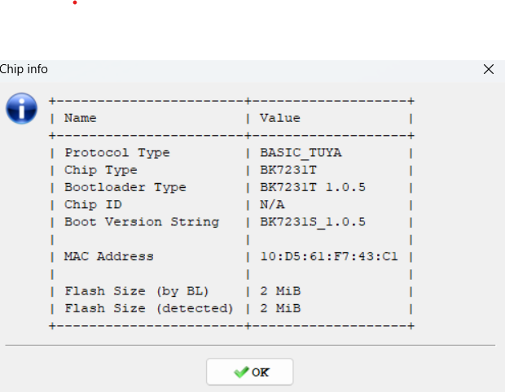

# EMAX-Tuya
EMAX smart power sockets that is based on Tuya and one can buy from e.g. Motonet [95-02136](https://www.motonet.fi/tuote/emax-alypistorasia-energiankulutusmittarilla?product=95-02136) and the importer homepage is [emaxsmarthome](https://emaxsmarthome.fi/product/alypistorasia-16a-3500w-energiakulutusmittarilla/)

## Hypotheis 
I should be possible to convert to Esphome with [LibreTiny](https://esphome.io/components/libretiny.html) project and by that enable the device to only exist in an private lan without going to internet. 

## Reverse engineering
Opening up the device gives this is an [WB2S](https://docs.libretiny.eu/boards/wb2s/) and reading out the software with the help of [ltchiptool](https://github.com/libretiny-eu/ltchiptool) 
and and basic RT232L USB dongle. 

