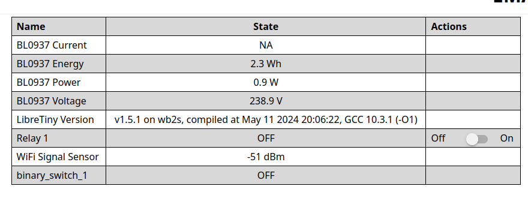

# EMAX-Tuya

<!-- 
SPDX-License-Identifier: MIT
-->
<!--
[](https://api.reuse.software/info/git.fsfe.org/reuse/api)
-->
[](https://securityscorecards.dev/viewer/?uri=github.com/andy778/EMAX-Tuya)

EMAX smart power sockets that is based on Tuya and one can buy from e.g. Motonet [95-02136](https://www.motonet.fi/tuote/emax-alypistorasia-energiankulutusmittarilla?product=95-02136) and the importer homepage is [emaxsmarthome](https://emaxsmarthome.fi/product/alypistorasia-16a-3500w-energiakulutusmittarilla/)

This have now been added to [tuya-cloudcutter](https://github.com/tuya-cloudcutter/tuya-cloudcutter.github.io/commit/1f579ddf50f7668a34c5097660ae8301644443fc) but the tuya-cloudcutter vulnerability this requires, was patched so one could probably not use this any more!   


## Hypotheis 
I should be possible to convert to ESPHome with [LibreTiny](https://esphome.io/components/libretiny.html) project and by that enable the device to only exist in an private lan without going to internet. 

## Reverse engineering
Opening up the device and a ocular inspection of the chip gives this is an [WB2S](https://docs.libretiny.eu/boards/wb2s/) 


### Serial port 1
This port is used as a for programing the device and reading out the software with the help of [ltchiptool](https://github.com/libretiny-eu/ltchiptool) 
and and basic RT232L USB dongle the chip info and software versio is [Get chip info from ltchiptool](Get_chip_info.png).

Reading out the ROM file can also be dobe with ltchiptool (I used a Windows 11 OS for this). Analyzing the dumped out software can be dessected with [bk7231tools](https://github.com/tuya-cloudcutter/bk7231tools) 
```
$ bk7231tools dissect_dump -e -O dump_extract_dir orginal.bin 
RBL containers:
	0x10f9a: bootloader - [encoding_algorithm=NONE, size=0xdd20]
		extracted to dump_extract_dir
	0x129f0a: app - [encoding_algorithm=NONE, size=0xf0200]
		extracted to dump_extract_dir
Storage partition:
	0x1ee000: 32 KiB - 12 keys
	- 'gw_bi'
	- 'user_param_key'
	- 'gw_wsm'
	- 'is_stride'
	- 'gw_di'
	- 'tls_ca_cnt'
	- 'gw_ai'
	- '0000032ccw'
	- 'timer_arr'
	- 'em_sys_env'
	- 'astro_timer'
	- 'mf_test_close'
		extracted all keys to dump_extract_dir/orginal_storage.json
Storage area `user_param_key`:
	- found! Extracted to dump_extract_dir/orginal_user_param_key.json
```

### Serial port 2 
This port is used as a console port and logs what happens on the device.

Connecting RT232L USB dongle to [serialport](cabling.png) the chips gives this output [tuya.log](tuya.log). Note! it will probably need external power in order to flash new software to it. 

## Flashing the device 
As there was no EMAX in the list of boards I added orginal_storage.json to [upk.libretiny.eu](https://upk.libretiny.eu/) genrate an yaml file that one can add to Home Assistant and ESPHome.  

### Get an yaml file for ESPHome
```
Found BK7231T config!
Switch/plug config
 - relay 1: pin P24
 - button 1: pin P10
Status LED: pin P26, inverted True
Power monitoring chip BL0937: CF/ELE=P6, CF1/VI=P7, SEL=P8
 - shunt resistor: 1 mΩ
```
A file made based on inpirtaions from [upk.libretiny.eu](https://upk.libretiny.eu/) [emax.yaml](emax.yaml)

### Dowload the binary to WB2S
Add new device in ESPHome (Home Assistant) and select WB2S device and add the yaml file from this repo and when compiling select to download the u2f file format and use that file to download to the device over serial port 1. After this one see the webservice with the values  .

Note I got 422.2V where it should be around 240V so either I have some broken shunt resistor or it requires [calibration](https://esphome.io/components/sensor/hlw8012.html#configuration-variables).


